#   Python MNPBEM GUI Guide 

### Setup
Detailed setup instructions can be found in the [setup guide](./GUI_SETUP.md).

## How to use the GUI
The GUI is divided into 3 main screens: __Setup__, __Simulation__, and __Post-Processing__. 
>At this time, there is no way to move to the previous screen, so any mistakes made on the previous screen will have to be corrected by running the GUI again.

#### Using graph settings

All matplotlib graphs in the GUI share similar tools which allow for changing what is shown as well as saving as an image/pdf. These tools can be found in a bar on top of the graph as shown below.

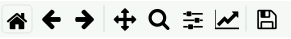

The 3 most important settings are the 3 rightmost buttons. The floppy disk is used to save the graph, and is straightforward.

##### Configure Subplots
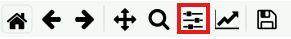

The "Configure Subplots" button, which is highlighted above (the button with sliders) is used to change the area on the Figure window that the graph is allowed to be in. 

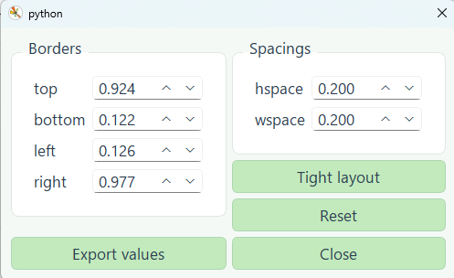

The borders and spacings of the graph area are able to be changed freely, and will update live as they are edited. The most useful setting here is the "Tight Layout" button, as it will attempt to fit the graph nicely onto your screen.

##### Edit Axis and Curves

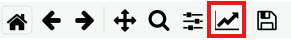

The "Edit axis, curve, and image parameters" button, which is highligthed above (the button with an arrow on a plot) is used to change a variety of options above the axes and curves, including color, bounds, labels, and style. 

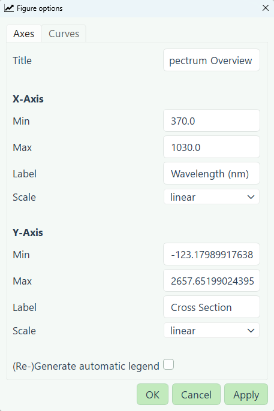 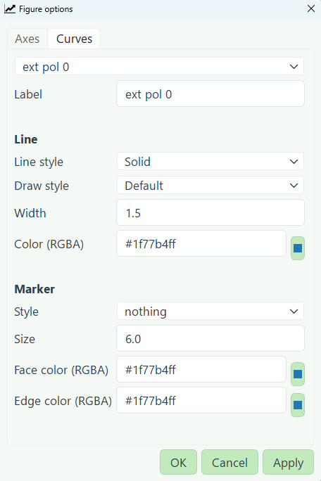

If you would like to remove a curve, simply change the line style to "None" and click the "Apply" button to remove it. To show the individual points on a plot, change the marker from "nothing" to your desired style.

### Setup

Launching the GUI will bring you to the setup screen, where you can configure the compute settings (number of workers, threads, and GPUs per worker) as well as load material files for use in the simulation.

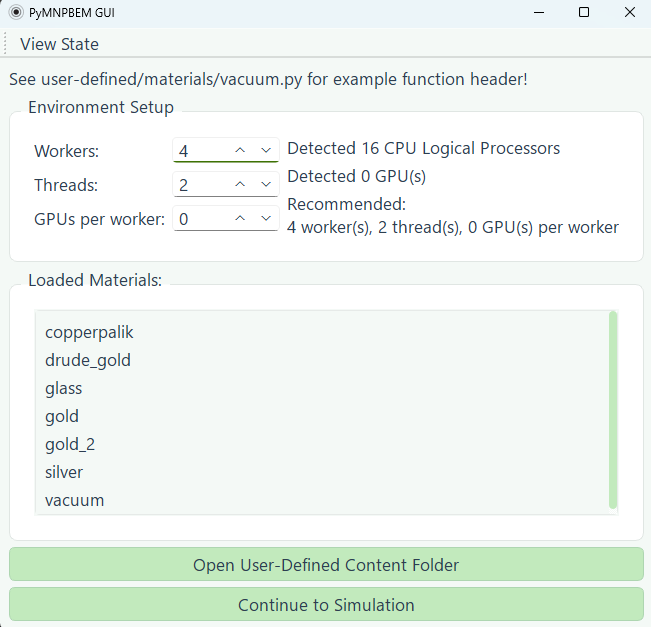

#### Environment Setup

The main driver of the simulation is the number of workers, which each run the specified amount of threads. It is generally recommended to not have the total number of threads (`workers * threads`) exceed the amount of physical cores in your CPU when running in CPU mode (GPUs per worker set as 0).

The Setup screen will automatically detect the amount of CPU logical processors (not the amount of physical cores) and the amount of GPUs. For most CPUs, the amount of physical cores is half the amount of logical processors, but verify by checking for your machine first. When running the simulation in GPU mode, do not exceed the number of connected GPUs (threads can still be increased).

There will be a recommended configuration, but it does not guarantee the best performace. Benchamarking different configurations can help find the best configuration for your system.

#### Loading Material Files

The user defined content folder can be opened by pressing the button at the bottom of the screen labeled "Open User-Defined Content Folder". In the folder labeled "materials", all of the material files for the simulation are placed. 

For a material file to be recognized as valid, it must be either a `.dat` table file with 3 columns: Energy (in eV), n, k where n is the real part of the refractive index and k is the imaginary part (often called the extinction coefficient), or a `.py` code file with a specific function header. An commented example of the function header can be found in the `vacuum.py` material file, and can serve as a reference for creating your own. 

While on the setup screen, any new files added to the material folder will automatically be loaded, and should appear in the "Loaded Materials" section if they are successfully loaded into the GUI. If a file is added to the folder after continuing to the simulation screen, then it will only be loaded on the next time the setup screen is shown.

#### Continuing to Simulation
Once the environment has been configured, and all desired materials have been loaded into the simulation, pressing the "Continue to Simulation" button at the bottom of the screen will progress to the simulation configuration.

### Simulation

This screen is where all of the settings for the metal nanoparticle BEM simulations are configured, and several properties can be examined. At this time, the simulation will solve for cross section spectra, and near field enhancement.

Once all settings have been configured, the simulation can be started with the button labeled "Run Simulation" on the right side.

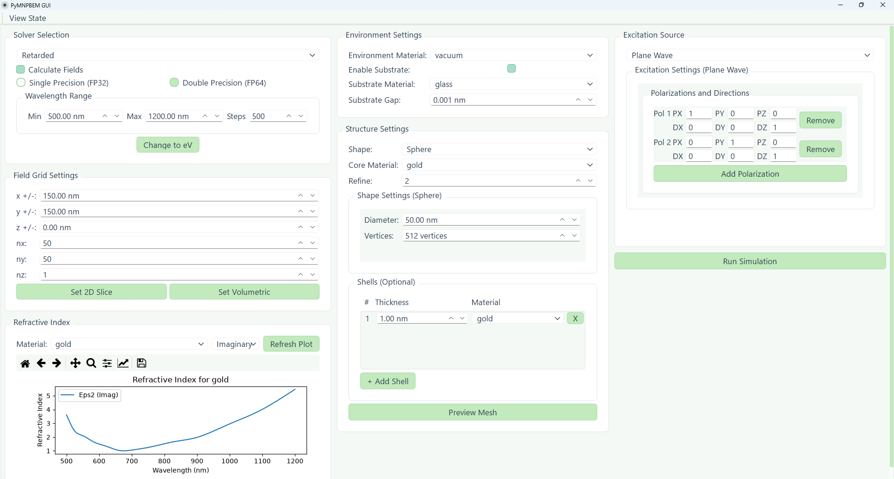

#### Solver Selection

This widget determines which solver should be used for the simulation, whether to solve for fields, the range of wavelengths/energy to solve over, and GPU precision (if applicable). 

The wavelength range uses spline interpolation with the number of steps to genereate the wavelengths to calculate for, with more steps giving a more accurate simulation. 

#### Field Grid Settings

If field calculations are enabled, the field grid is the area and amount of points the field is calculated at. It is recommended to have at least double the diameter of the structure on each side. An example is a 50nm diameter sphere would be recommended to have the x and y set at at least 100nm in each direction.

Increasing nx and ny increases the number of points caluclated, which corresponds to how accurate the resulting grid is. More points means a less blurry-looking interpolated graph in your results.

The z range and steps can remain at 0, as unless a 3D graph of points is required, one slice generally illustrates the structure quite well. Increasing the amount of slices will have a large impact on run time for field calculations, so only change it when needed.

#### Refractive Index Graph

This graph is purely for inspecting the dielectric function of the materials, and does not effect the simulation at all. It allows for viewing the real and complex dielectric function of any loaded material, either separately or on the same graph.

#### Environment Settings

The environment settings are for configuring the materials of the surrounding area of the particle. There is a toggle box to enable substrate, which allows for configuring both the material and the distance from the structure of the substrate if enabled. The substrate can be seen on the mesh preview in structure settings as well.

#### Structure Settings

Structure settings allows the user to choose the shape and material of the structure, as well as configure the mesh shape and density. The "refine" parameter does not effect the quality of the mesh, but increases the precision of the calculations. It should generally remain as 2-3, and is generally not recommended to be changed by the user. 

Each shape has it's unique parameters appear under "Shape Settings (*selected shape*)", with some commonalities. The "Mesh Element Size" parameter is the distance between the vertices in nm, and decreasing the element size increases the amount of faces/vertices. 

Uniquely, the sphere shape does not have this parameter and instead directly uses the direct vertex count. This means it behaves the opposite of mesh element size, and more vertices creates a more dense mesh.

In the table at the bottom of the structure settings, the user can add uniform shells around their structure and configure material and thickness. These shells are the exact same shape as the core, and also inherit the same density parameters (or vertex count). The shells have no gap between the core and the shell.

##### Mesh Preview

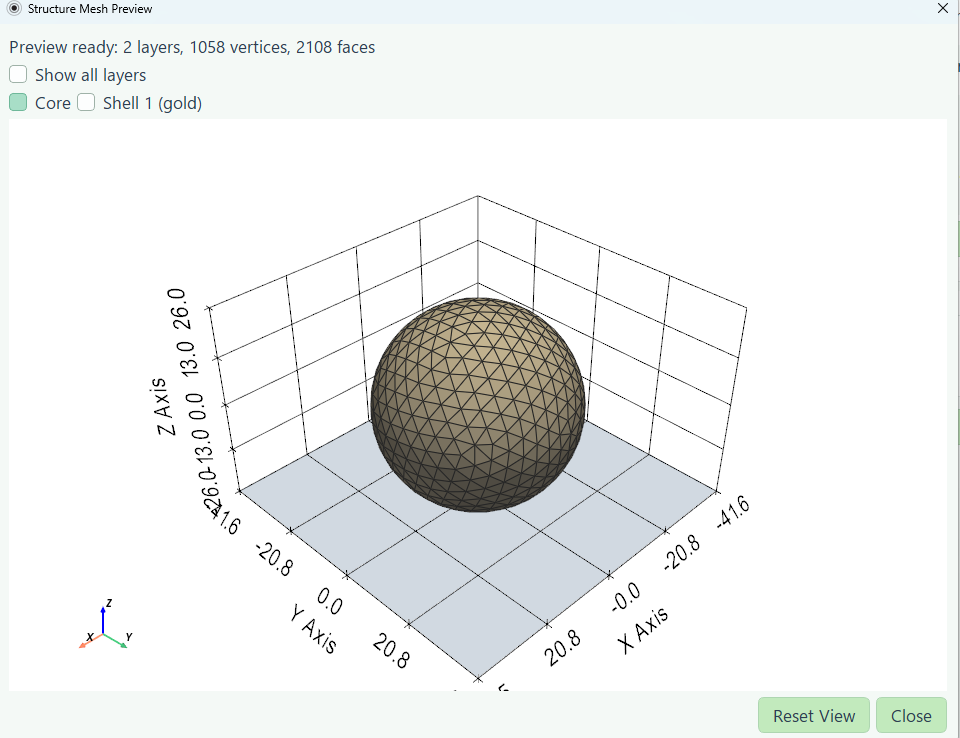

Once a structure and material have been selected, the "Preview Mesh" button can be used to look at what the simulated structure is going to be. In this example image, there is a nanosphere with substrate and one shell. The darker plane at the bottom of the model is the substrate in this case.

At the top of the window, the different layers of shells and core can be selected to see what they look like. At this time there is no way to view a cross section of the structure.

#### Excitation Settings

This section is used to select the excitation source for the experiment. At this time, the field calculations are only compatible with plane wave excitation. 

The plane wave settings allow for multiple polarizations, with PX, PY, PZ being the polarization vector and DX, DY, DZ being the direction vector. In the post-processing section, the results for each polarization can be averaged if desired.

#### Simulation Window

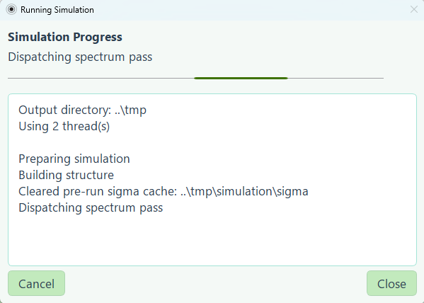

Once the simulation is started with the "Run Simulation" button, a progress window will appear to show relevant information. More descriptive output is shown in the command prompt/console if desired. Once the simulation is finished, the GUI will continue to the post-processing screen once the "OK" button is pressed on the pop-up window.

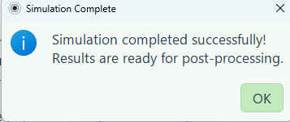

### Post-Processing

At this time, the post-processing window supports 2 pages of calculations. The spectra page shows the optical cross section, while the fields page shows the near field enhancement.

#### Spectra

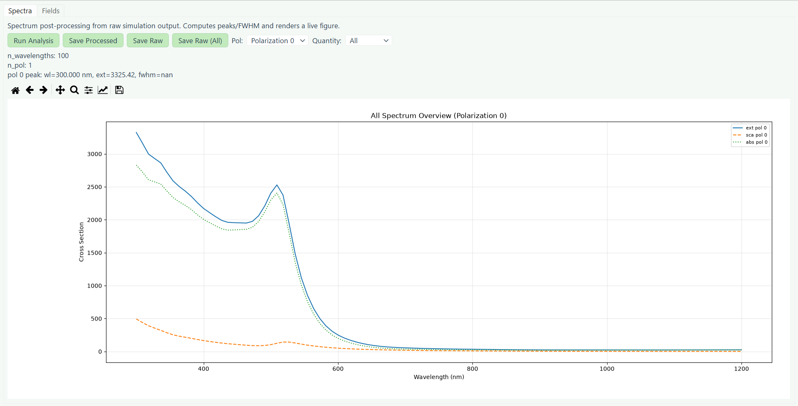

By pressing "Run Analysis", the cross section spectra will be shown in the area below. Using the "Pol" and "Quantity" boxes, the polarization and desired value can be graphed. If "All Polarizations" are selected, the average will also be graphed alongside the polarizations.

Any changes to the polarization viewed can only be see after pressing the Run Analysis button again.

#### Fields

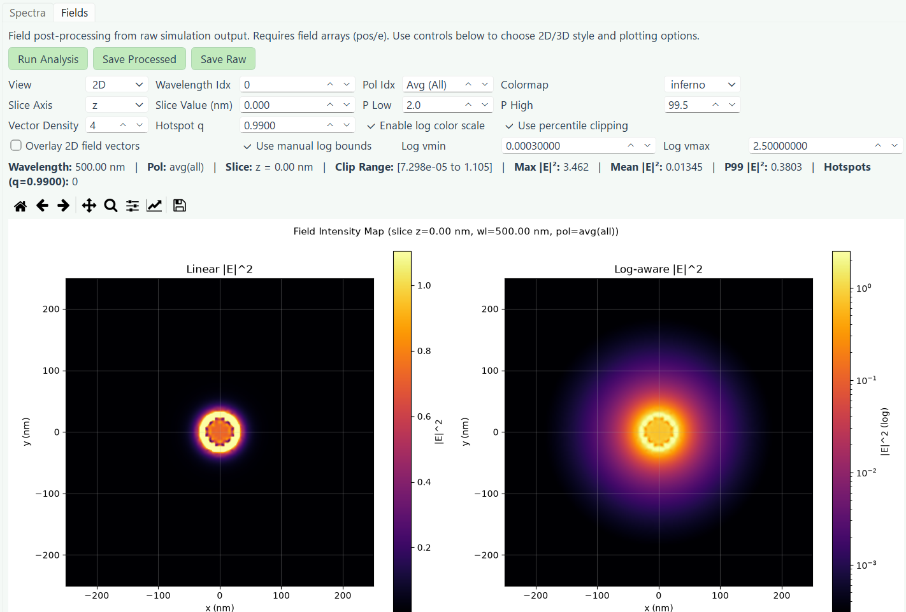

The fields screen shows the near field enhancement, in both linear and log color scale. The "View" box has 4 different settings: Auto, 2D, 3D, and Scatter. Auto will select either 2D or 3D depending on the amount of z slices. 2D is the interpolated version of Scatter, so if you would like to see the uninterpolated graph scatter is a good backup.

The wavelength index is the step (zero indexed) from the simulation page you are viewing. The actual wavelength value can be seen at the title of the graph after hitting run analysis. The Pol Idx is the index of the polarization of the plane wave, starting at zero. If negative 1 is selected, it will instead average all of the polarizations and say "Avg (All)" as shown in the image. 

By default, the color scale is based off of percentiles, which can be set by P Low and P High. If "Use Percentile Clipping" is disabled, the bounds can be manually set by enabling "Use manual log bounds" nad changing log vmin and log vmax.